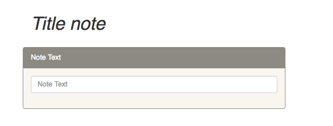
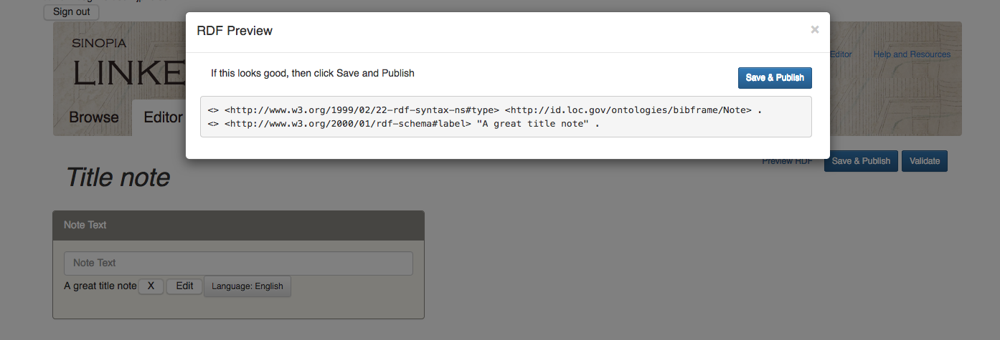
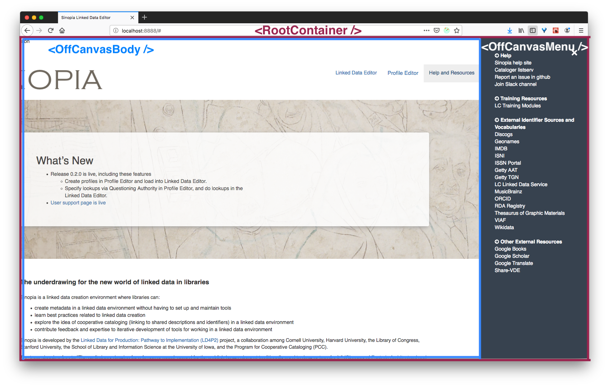
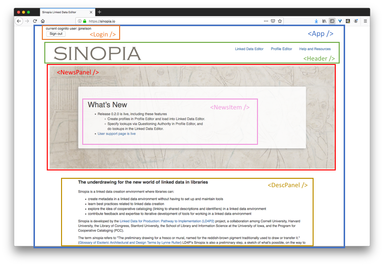
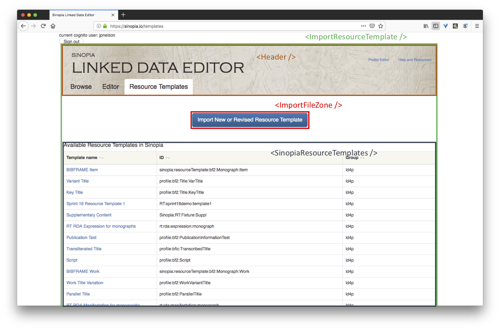
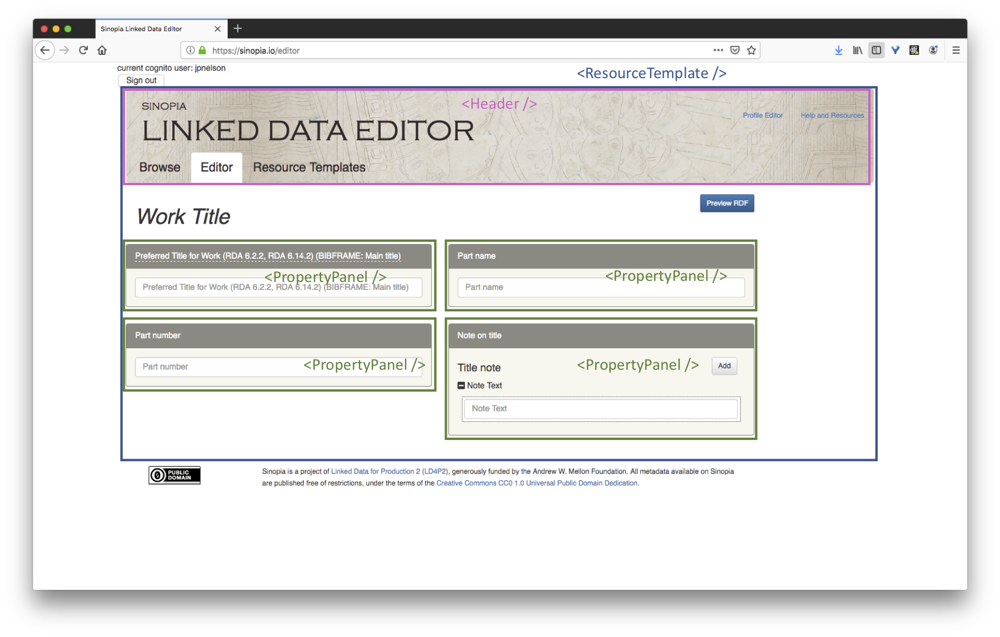
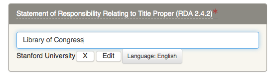
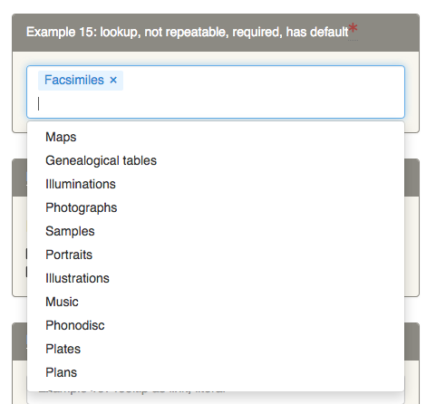
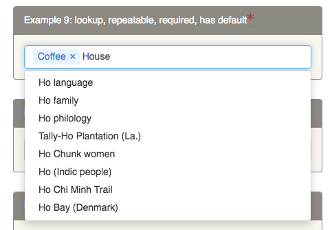
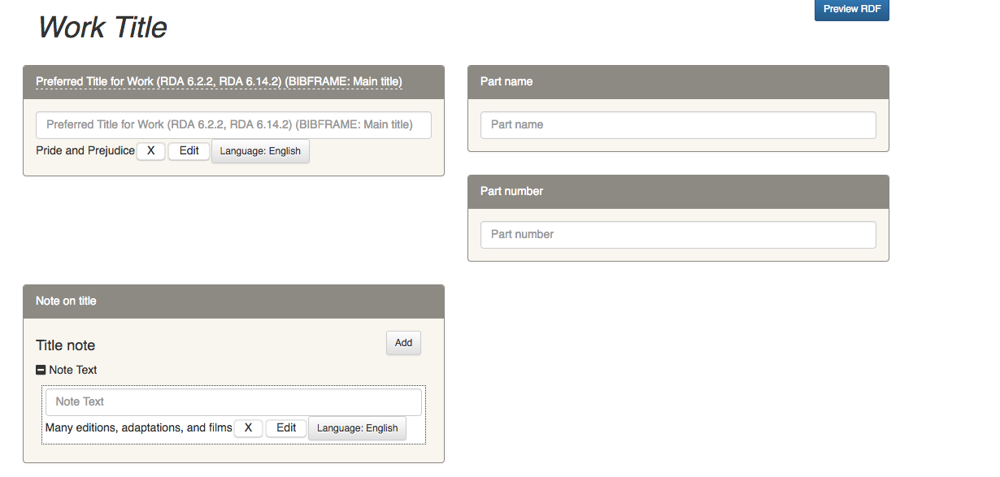

# Introduction
## Background of Sinopia
Funded by the Adrew W. Mellon Foundation as part of the  LD4P (Linked Data for Production) grant,
[Sinopia][SINOPIA], available at [https://sinopia.io][SINOPIA], is an open-source, cloud-based 
collaborative linked-data cataloging environment that could be used in a production environment. 
The Sinopia project's primary software development team are members of the Stanford University 
Libraries, with Michelle Futornick as the project owner, prioritizing user needs and requirements in an iterative manner following 
[Agile](#AGLE1) software practices.

The Agile development methodology provides an approach and processes for responding to changes in 
requirements or environment by emphasizing flexibility and adapting to those changes. Specific Agile practices
of the Stanford development team uses include pair programming, unit and integration testing, 
stand-up meetings, planning sessions, and sprints. 
In pair programming two or more developers collaborate together to code or solve specific problems
by having one programmer type while both developers talk through the problem together, thereby increasing code
comprehension and knowledge transfer within the team. Another critical Agile practice used by the Sinopia 
development team is creating unit tests for specific Javascript modules in addition to integration tests that test interactions
between multiple components and modules in the code base through scripting actions in a headless web browser.
The Sinopia development team also has daily stand-up meetings where the developers check-in with each other and 
the product owner on progress and challenges encountered in the previous day, as well as plan for the upcoming day.
The Sinopia team is organized in one to two week sprints that attempt to accomplish a specific goals and
tasks within the sprint. Each sprint also includes a planning meeting at the beginning of the sprint and weekly
storytime meeting where challenges and issues that often require the project owner's feedback and decisions 
that are then incorporated into the sprint execution.  

At the start of the Sinopia project, the decision was made by team to build the linked data editor based on the previous
development work done by the Library of Congress in the creation of their [BIBFRAME Editor][BFE] or BFE, along
with supporting projects like the [BIBFRAME Profile Editor](https://github.com/lcnetdev/profile-edit) and 
[Verso](https://github.com/lcnetdev/verso). The Library of Congress catalogers have been using the BFE to 
catalog books and other materials for specific workflows related to the Library of Congress infrastructure. 
Christine Harlow, now at Temple University, created Sinopia's architecture for deploying first a copy of the 
of the Library of Congress BIBFRAME Profile, called a fork, in [Amazon Web Services](https://aws.amazon.com/) (AWS) with
the Linked Data Editor to follow. Because the initial BFE codebase was a monolithic Javascript module and the
BFE lacked any unit or integration tests, it was decided that a fork of the BFE code base for Sinopa Linked 
Data Editor was necessary in order to address design and implementation shortcomings present in the BFE. In 
addition, a new backend architecture was necessary that leveraged AWS services like 
[Cognito](https://aws.amazon.com/cognito/), a user authentication service, and to host an instance of 
[Trellis](https://www.trellisldp.org/), a linked-data platform that allows the use of a Postgres relational 
database to store the output of the Linked Data Editor.   

Two partners in the Sinopia project provide an important service called [Questions Authorities](https://github.com/samvera/questioning_authority) 
(QA), a joint project of Cornell University and the University of Iowa. QA is an API service that queries Lucene 
indexes of both RDF and non-RDF datastores and returns JSON data of the results. This service provides an intermediary 
source of lookup data for the Library of Congress [subject](http://id.loc.gov/authorities/subjects.html) and 
[name](http://id.loc.gov/authorities/names.html) authorities, the Getty Linked 
Data [vocabularies](http://www.getty.edu/research/tools/vocabularies/lod/) and [ShareVDE](http://www.share-vde.org/).

## Functional Javascript 
Within the programming community, the ubiquity of Javascript as the default programming language for 
scripting websites and applications means most developers have at least a passing knowledge of the
language. While client-side manipulation of the HTML DOM (document object model) has changed over the
years with the introduction of Javascript libraries like [JQuery][JQUERY] and the continued addition of different
supporting technologies, Javascript has morphed into a server-side language with the emergence of the [Node.js][NODE]
ecosystem.

Sinopia uses ECMAScript features and conventions that is then converted into Javascript using the [Babel][BABEL] 
compiler. ECMAScript 6 features used in Sinopia include class declarations such as `class Input {...}`, importing of
Javascript modules like `import Input from './Input` and to support the import, using the export feature like 
`export const Input`. Because Sinopia's Linked Data Editor communicates in an asynchronous fashion with the 
Sinopia server backend, the ECMAScript 7 and 8 features (like Promises with `async` and `await` keywords) are used
in the code. Finally, Sinopia extensively uses the ECMAScript spread operator, **...** for expanding passed arguments or
elements to simplify object cloning.  An example is this expression: `const newState = { ...state }`, where newState is a clone of 
the existing state. Sinopia also adopted the arrow function syntax
`() => {}` throughout the code base.

Javascript supports multiple programming paradigms, such as imperative, object-oriented, and, 
in the past ten years, the functional programming approach. The popularity of building functional [React][REACT] 
and [Redux][REDUX] code for web browser and native user interfaces has encouraged the use of Javascript built-in 
`map` and `reduce` operators, along with support for currying and other functional-friendly constructs like 
the `=>` arrow functional form. The key insight in writing functional Javascript is focusing on functions 
with minimal side-effects and deterministic expectations: that given a set of inputs, the function will always return the same
 set of outputs.  

For example, a traditional Javascript function is declared using the `function` keyword:
```javascript
function AddTwo (x,y) {
  return x+y;
}
```

A more functional ECMAScript using the `const` keyword and arrow functional form looks like:

```javascript
const AddTwo = (x,y) => {
  return x+y
}
``` 
Both of these `AddTwo` functions are equivalent in that they take two input parameters and return a 
single value. The `const` keyword for the second is a critical difference in that it creates an immutable 
function that cannot be reassigned to another function or variable in subsequent code, while defining the
`AddTwo` function in the first form can be reassigned without the Babel compiler complaining. The `const`
keyword reduces the opportunity for accidentally introducing bugs by preventing the developer from
reassigning the function with potentially harmful or unintentional effects.  

A Javascript Array is a list-like Object that contains two methods [`map`](https://developer.mozilla.org/en-US/docs/Web/JavaScript/Reference/Global_Objects/Array/map) 
and [`reduce`](https://developer.mozilla.org/en-US/docs/Web/JavaScript/Reference/Global_Objects/Array/Reduce) that helps in 
developing functional code for React components and Redux reducers. The `map` method returns a new Javascript array with the 
results of executing a function on every member in the original array. Using the arrow functional form with the `map` 
method results in simpler implementation code and is fully functional by taking two inputs, the array and an anonymous 
function defined with the arrow functional form, and returns a new Array. In the example below, starting with an integer
array, performing a `map` call returns a new Array `firstFiveSquared` with each value of the original Array raised to the 
second power: 

```javascript
const firstFive = [1,2,3,4,5]

const firstFiveSquared = firstFive.map(row => row**2)

console.log(firstFiveSquared)
Array(5) [ 1, 4, 9, 16, 25 ]

```

The `reduce` method with the arrow functional
form applies an anonymous function that reduces the members of the array to a single member object.
In Sinopia, the `reduce` function is used in the `inputPropertySelector` function to go through a
complex JSON hierarchy representing the current values of the React components in the user interface
and either return the component's items or an empty array based on the values of the component's
reduxPath. 

```javascript
const inputPropertySelector = (state, props) => {
  const reduxPath = props.reduxPath
  let items = reduxPath.reduce((obj, key) => (obj && obj[key] !== 'undefined' ? obj[key] : undefined), state.selectorReducer)

  if (items === undefined) {
    items = []
  }

  return items
}
```

## Resource Templates and Profiles
The Library of Congress's [Bibframe Editor][BFE] was an important source of inspiration for Sinopia. 
To support a wide range of cataloging use cases, the BFE 
followed a two-part strategy.  First, a user creates a JSON Profile containing one or more Resource 
Templates in the BIBFRAME Profile Editor.  These templates can vary by the material being cataloged
and are then saved in a backend server, running the 
[Verso](https://github.com/lcnetdev/verso) middleware from
the Library of Congress.  This template is then loaded into the BFE to generate different types of user interfaces depending on the requirements for the material. So, for example, a Monograph Profile contains a BIBFRAME Work and Instance Resources
Templates along with any supporting Resource Templates that a user could then load into the BFE to 
catalog a Book Instance or Work. The Profile JSON file containing one or more Resource Templates is in effect
a Domain Specific Language (DSL) for generating the user interface needed by the user to catalog 
a specific type of BIBFRAME entity. The Profile DSL, while developed for the BIBFRAME ontology, is generic
enough that other linked-data vocabularies can be used in addition to BIBFRAME, though they must be specified within 
a Resource Template. 
 

A Resource Template contains a number of properties that define properties such as the label to display in the
user interface, an URI to use as the RDF type, and one or more properties contained in the `propertyTemplate`
list. Sinopia, following the BFE's example, only displays one top-level Resource Template at a time in the editor
user interface. A source of confusion early on in the project arose when analyzing the Library of Congress set of 
Profiles, as the id of a profile was often duplicated as one of the ids of the contained Resource Templates. 
This was fixed in later iterations of these Library of Congress Profiles.


Here is an example of a Resource Template for a BIBFRAME Note that could then be referenced by other Resource 
Templates:

```javascript
{
  "id": "resourceTemplate:bf2:Note",
  "resourceURI": "http://id.loc.gov/ontologies/bibframe/Note",
  "resourceLabel": "Note",
  "propertyTemplates": [
    {
      "propertyURI": "http://www.w3.org/2000/01/rdf-schema#label",
      "propertyLabel": "Note",
      "mandatory": "false",
      "repeatable": "false",
      "type": "literal",
      "resourceTemplates": [],
      "valueConstraint": {
        "valueTemplateRefs": [],
        "useValuesFrom": [],
        "valueDataType": {},
        "editable": "true",
        "repeatable": "false",
        "defaults": []
      }
    }
  ]
}
```

The source for constructing the actual user interface components used by the Sinopia Linked Data 
Editor are the properties in the `propertyTemplates` list. Each property contains a `propertyURI` attribute 
that is used as the RDF predicate in the constructed RDF while the `propertyLabel` is displayed in user interface
either as an HTML label or as a placeholder in the HTML input. With the `resourceTemplate:bf2:Note` resource 
template above, Sinopia's editor generates the following display:



After entering the text, "A great title note", this resource template generates a RDF graph using a relative URI
as seen here (when the user clicks the **Preview RDF** button):




Other attributes for the property include *mandatory* set to true if the property is required, and
*repeatable* if the property can be duplicated. Early in the development of Sinopia, the decision was to limit and 
simplify what values are supported in the *type* property, with the simplest being `literal`, and the others being 
`lookup`, `list`, and `resource`.
The `literal` property are for string values that are entered by the user, while the `list` and `lookup` types
references typeahead components for searching and linking external entities and values in the user interface. The 
*valueConstraint* attribute contains a number of sub-attributes like *defaults*, as a list of one or more values that
are used to pre-populate the values in the input fields.   

The `resource` type is more complicated in that it references another Resource Template through the 
*valueConstraint*'s *valueTemplateRefs* attribute. The *valueTemplateRefs* attribute is a list of one or more 
Resource Template IDs that are then used to embedded a Resource Template into the user interface so that the 
values entered act as a separate entity that is then linked to the calling property. When generating the RDF,
an URI or blank-node of the embedded Resource Templates are positioned in the RDF object role with the original 
Resource Template as the RDF subject and the *propertyURI* property functioning as the RDF predicate.
 
Below is an example of a *propertyTemplate* with a type of **resource** that references the ID of the Resource
Template above, `resourceTemplate:bf2:Note` in the *valueConstraint.valueTemplateRefs* attribute:

```javascript
    {
      "propertyURI": "http://id.loc.gov/ontologies/bibframe/note",
      "propertyLabel": "Notes about the Work",
      "mandatory": "false",
      "repeatable": "true",
      "type": "resource",
      "resourceTemplates": [],
      "valueConstraint": {
        "valueTemplateRefs": [
          "resourceTemplate:bf2:Note"
        ],
        "useValuesFrom": [],
        "valueDataType": {},
        "defaults": []
      }
    }
```

## React Components
An open-source project sponsored by Facebook, [React][REACT] is a Javascript library that wraps
HTML elements in defined classes and functions for building user interfaces. React classes and functions are often
defined in an extension of Javascript called JSX that is used to build components that can be assembled into
larger, more complex user interfaces. For example, a relatively simple JSX component could represent a title on a 
page with an HTML H1 tag with valid Javascript expression embedded between curly brackets:

```javascript
const title = <h1>Book Title: {title}</h1>
```

React components also have two important Javascript arrays called `props` and `state`. 
The `props` array contains read-only properties that can be referenced within the component itself using the
curly braces syntax and are set when the component is constructed. Because the component's `props` are read-only,
this enforces the constraint that the `props` are immutable and follow a pure functional form. While creating
React component in pure functional form is possible, using the ES6 Class syntax allows for more comprehensible 
code that extends the base `React.Component` class. A React component class must implement a `render` method 
that returns the desired Javascript.

The title Javascript expression above could be refactored as a simple ES6 Class by extending the `React.Component`
and return the HTML snippet with the title prop referenced using the `this` keyword indicating a class instance
variable: 

```javascript
class Title extends React.Component {

  render() {
    return (<h1>Book Title: {this.props.title}</h1>)
  }
}
```

If coming from object-oriented languages, the temptation might be to create a hierarchy of React components, but
this pattern is discouraged by the designers of React because React components are intended more for composition, 
where more complex React components are made-up of simpler components where the enclosing components pass properties
down through the child's initial props. To illustrate, here is a `Header` Reaction component that 
contains other React components with the `<Title>` component's `title` prop being set to "Pride and Prejudice".

```javascript
class Header extends React.Component {

  render() {
    return(<header>
            <Title title={"Pride and Prejudice"} />
            <Author givenName={"Jane"} familyName={"Austen"} />
           </header>)
  }
}
```

This `Header` component could render this output to the web browser's DOM like this:

```html
<header>
  <h1>Book Title: Pride and Prejudice</h1>
  <p>by Jane Austin</p>
</header>
```

### Sinopia's React Components

Sinopia's React components are built as JSX Class Components that are complied into Javascript functions
using [Babel][BABEL]. To build out the user interface for the Linked Data Editor, Sinopia uses a combination 
of third party React components along with custom React components. Sinopia's Linked Data editor is a hierarchy 
of components with `<RootContainer>` being the top-level React component. The `<RootContainer>` imports the 
`<OffCanvas>` that is composed of two children, the `<OffCanvasMenu>` and the `<OffCanvasBody>` components 
both from the [react-offcanvas](https://www.npmjs.com/package/react-offcanvas) module. The `<OffCanvasMenu>` 
presents a list of links to help and third-party resources displayed in a pane displayed when the 
**Help and Resources** link in the navigation bar is clicked. The other function of the `<RootContainter>` component
is to connect the React user interface to the Redux state store that will be explored in the next section.




### HomePage and User Authentication
When accessing Sinopia's homepage at [sinopia.io](https://sinopia.io/), the `<App />` React 
component, using the `<Switch />` and `<Route />` React components from the react-router-dom package,
displays the `<HomePage />` and the standard Sinopia `<Footer />` React components. The `<HomePage />`
component contains three children, the `<Header />`, `<NewsPanel />`, and the 
`<DescPanel />` React components. The homepage's `<Header />` contains links to the `/templates` route, 
a link to Sinopia's Profile Editor, and finally a link that activates the `<OffCanavsMenu />`'s child's 
`<CanvasMenu />`. The `<NewsPanel />` has a `<NewsItem />` that allows the product owner to make 
announcements by editing and then creating a pull request that can then be reviewed and then pushed to the
AWS environments by the developers and system administrators. The `<DescPanel />` contains more general
description of the Sinopia project and what the project hopes to accomplish during the grant period and 
after.

The `<App />` also contains the `<LoginPanel />` component that uses the Amazon's [Amplify SDK](https://aws-amplify.github.io/docs/js/api)
to authenticate the user to the AWS Cognito service that then generates a valid [JSON Web Token](https://jwt.io/a) 
for user authentication in Sinopia and in Sinopia's backend [Trellis][TRELLIS] Linked Data Platform. For the 
initial release of Sinopia, all catalogers are authorized to add, edit, or delete any resources stored in
Trellis. This may change in future releases with more restrictive user rights for resources created in 
specific group containers within Trellis. 

The React Component Hierarchy for the `<App />`'s `<HomePage />`, `<LoginPanel />`, and `<Footer />`:

* [`<App>`](https://github.com/LD4P/sinopia_editor/blob/master/src/components/App.jsx)
  * [`<LoginPanel>`](https://github.com/LD4P/sinopia_editor/blob/master/src/components/LoginPanel.jsx)
    * [`<Switch />`](https://reacttraining.com/react-router/web/api/Switch)
      * [`<Route />`](https://reacttraining.com/react-router/web/api/Route) => [`<HomePage />`](https://github.com/LD4P/sinopia_editor/blob/master/src/components/HomePage.jsx)
        * [`<Header />`](https://github.com/LD4P/sinopia_editor/blob/master/src/components/Header.jsx)
        * [`<NewsPanel />`](https://github.com/LD4P/sinopia_editor/blob/master/src/components/NewsPanel.jsx)
          * [`<NewsItem />`](https://github.com/LD4P/sinopia_editor/blob/master/src/components/NewsItem.jsx)
        * [`<DescPanel />`](https://github.com/LD4P/sinopia_editor/blob/master/src/components/DescPanel.jsx)
  * [`<Footer />`](https://github.com/LD4P/sinopia_editor/blob/master/src/components/Footer.jsx)

Below are these React Components diagrammed in a screen shot of Sinopia's homepage at [sinopia.io](https://sinopia.io/):



#### `<HomePage>` Child Components

*  `<Header>` **Component**
The `<Header>` component for Sinopia's homepage has a different navigation bar with links to the `<ImportResourceTemplate >`,
Sinopia's Profile Editor, and a link to activate the `<OffCanvasMenu>` to display the Help and Resources links. 

*  `<NewsPanel>` and `<NewsItem>` **Components**
The `<NewsPanel>` component is composed of one `<NewsItem>` component that is a list of news items maintained by Sinopia's
product owner and is usually includes recent items like new Sinopia releases, conferences or presentations about Sinopia, 
and other items of interest to the Sinopia's community.  

*  `<DescPanel>` **Component**
The `<DescPanel>` component is a short description of the goals for Sinopia and the partner institutions in this project.

### Resource Templates Upload and Listing
From Sinopia's `<HomePage />`'s `<Header />`, an authenticated cataloger is taken to the `/templates` route using the 
`<ImportResourceTemplate />`component containing an `<Header />` component, an `<ImportFileZone .>` component used 
to display and handle a button for catalogers to upload a JSON profile file containing one or more resource templates, and 
a `<SinopiaResourceTemplates />` component displaying an HTML table populated by Resource Templates contained either in 
a running instance of the Sinopia Server or the sample Resource templates if running the Editor in server spoof mode.

* [`<App>`](https://github.com/LD4P/sinopia_editor/blob/master/src/components/App.jsx)
  * [`<LoginPanel>`](https://github.com/LD4P/sinopia_editor/blob/master/src/components/LoginPanel.jsx)
  * [`<Switch />`](https://reacttraining.com/react-router/web/api/Switch)
    * [`<Route />`](https://reacttraining.com/react-router/web/api/Route) => [`<ImportResourceTemplate />`](https://github.com/LD4P/sinopia_editor/blob/master/src/components/editor/ImportResourceTemplate.jsx)
      * [`<Header />`](https://github.com/LD4P/sinopia_editor/blob/master/src/components/editor/Header.jsx)
      * [`<ImportFileZone />`](https://github.com/LD4P/sinopia_editor/blob/master/src/components/editor/ImportFileZone.jsx)
      * [`<SinopiaResourceTemplates />`](https://github.com/LD4P/sinopia_editor/blob/master/src/components/editor/SinopiaResourceTemplates.jsx)
  * [`<Footer />`](https://github.com/LD4P/sinopia_editor/blob/master/src/components/Footer.jsx)




#### `<ImportResourceTemplate />` Child Components

* `<Header>` **Component**

For both the `/templates` and `/editor` routes and components, the same `<Header>` component is used for displaying the navigation
bar and the three tabs for the Browser, Editor, and Resource Templates. The `<Header>` component also contains three 
`<NavLink>` React components from the react-router-dom package that is highlights the correct tab depending on the route being
displayed in the editor.

* `<ImportFileZone />` **Component**

The `<ImportFileZone />` component wraps a [third-party React component]() that allows the cataloger to either use their 
computer's drag-and-drop a JSON Profile file containing one or more resource templates into the application that then 
validates the profile and resource templates first before uploading the resource templates to the Sinopia Server. 

* `<SinopiaResourceTemplates />` **Component**
The `<SinopiaResourceTemplates />` component is initialized with a call out to Sinopia Server's Trellis linked data platform
and loads all of the available resource templates for selection by the cataloger. 

### Linked Data Editor Tab
When a user selects a Resource Template from the `<SinopiaResourceTemplates />` table, Sinopia loads the JSON Resource Template
into a new instance of the `<Editor />`'s `<ResourceTemplate />` component. In the `<ResourceTemplate />` component functioning
as a container and connector to the Redux state, a `<ResourceTemplateForm />` creates a `<PropertyPanel />` for each property.
The React component hierarchy is outlined below:

* [`<App>`](https://github.com/LD4P/sinopia_editor/blob/master/src/components/App.jsx)
  * [`<LoginPanel>`](https://github.com/LD4P/sinopia_editor/blob/master/src/components/LoginPanel.jsx)
  * [`<Switch />`](https://reacttraining.com/react-router/web/api/Switch)
    * [`<Route />`](https://reacttraining.com/react-router/web/api/Route) => [`<Editor />`]()
      * [`<Header />`](https://github.com/LD4P/sinopia_editor/blob/master/src/components/editor/Header.jsx)
      * [`<RDFModal />`](https://github.com/LD4P/sinopia_editor/blob/master/src/components/editor/RDFModal.jsx)
      * [`<GroupChoiceModal />`](https://github.com/LD4P/sinopia_editor/blob/master/src/components/editor/GroupChoiceModal.jsx)
      * [`<ResourceTemplate />`](https://github.com/LD4P/sinopia_editor/blob/master/src/components/editor/ResourceTemplate.jsx)
        * [`<ResourceTemplateForm>`](https://github.com/LD4P/sinopia_editor/)
          * [`<PropertyPanel>`](https://github.com/LD4P/sinopia_editor/blob/master/src/components/editor/property/PropertyPanel.jsx)
            * [`<InputLiteral>`](https://github.com/LD4P/sinopia_editor/blob/master/src/components/editor/property/InputLiteral.jsx)
            * [`<InputListLOC>`](https://github.com/LD4P/sinopia_editor/blob/master/src/components/editor/property/InputListLOC.jsx)
            * [`<InputLookupQA>`](https://github.com/LD4P/sinopia_editor/blob/master/src/components/editor/property/InputLookupQA.jsx)
            * [`<InputLookupSinopia>`]()
            * [`<PropertyResourceTemplate>`](https://github.com/LD4P/sinopia_editor/blob/master/src/components/editor/property/PropertyResourceTemplate.jsx)
             * [`<PropertyTemplateOutline>`](https://github.com/LD4P/sinopia_editor/blob/master/src/components/editor/property/PropertyTemplateOutline.jsx)
               * [`<OutlineHeader>`](https://github.com/LD4P/sinopia_editor/blob/master/src/components/editor/property/OutlineHeader.jsx)
               * [`<PropertyTypeRow>`](https://github.com/LD4P/sinopia_editor/blob/master/src/components/editor/property/PropertyTypeRow.js)
                 * [`<PropertyComponent>`](https://github.com/LD4P/sinopia_editor/blob/master/src/components/editor/property/PropertyComponent.jsx)
                   * [`<InputLiteral>`](https://github.com/LD4P/sinopia_editor/blob/master/src/components/editor/property/InputLiteral.jsx)
                   * [`<InputListLOC>`](https://github.com/LD4P/sinopia_editor/blob/master/src/components/editor/property/InputListLOC.jsx)
                   * [`<InputLookupQA>`](https://github.com/LD4P/sinopia_editor/blob/master/src/components/editor/property/InputLookupQA.jsx)
                   * [`<InputLookupSinopia>`]()
                 * [`<ResourceProperty>`](https://github.com/LD4P/sinopia_editor/blob/master/src/components/editor/property/ResourceProperty.jsx)
                   * [`<PropertyTemplateOutline>`](https://github.com/LD4P/sinopia_editor/blob/master/src/components/editor/property/PropertyTemplateOutline.jsx)
  * [`<Footer />`](https://github.com/LD4P/sinopia_editor/blob/master/src/components/Footer.jsx)
         



#### `<Editor /`> Child Components

* `<RDFModal />` **Component**
Part of the `<Editor/`> is an HTML button labeled **Preview RDF** that when clicked shows a Bootstrap modal
containing the generated RDF based on the Redux state of the application. 

* `<GroupChoiceModal />` **Component**
At any point when adding or editing the RDF for the entity, the cataloger clicks the **Save &amp; Publish** button that brings
up a pop-up modal that displays a drop-down list of institutions and organizations 

* `<ResourceTemplate />` and `<ResourceTemplateForm />` **Components**
The `<ResourceTemplate />` Component includes the label of the loaded resource template, that **Preview RDF** and 
**Save &amp; Publish** buttons, and the `<ResourceTemplateForm />` that wraps one or more `<PropertyPanel />`.
The  `<PropertyLabel/>` component provides the text in the panel's header with one or more optional styling
using such components as the `<RequiredSuperscript />` to display a red asterisk for a required `<PropertyPanel />`.  

#### `<PropertyPanel />` **Component**
For every property template in the loaded resource template, an instance of the `<PropertyPanel />` is rendered. 
Understanding in depth how the `<PropertyPanel />` React component and it's children are constructed best
illustrates how Sinopia is able to build an editing environment for RDF triples. 

The first line in the `<PropertyPanel />` source code imports two Javascript classes 
from the React node module. The `PropTypes` import provides a means to check if the
`<PropertyPanel />`'s **props** are of a certain type. The third line imports the
`<PropertyPanel />` component.   

```javascript
import React, { Component } from 'react'
import PropTypes from 'prop-types'
import PropertyLabel from './PropertyLabel'

export default class PropertyPanel extends Component {
  constructor(props) {
    super(props)
  }

```

The `getCssClasses` is a simple class that set's the panel div's Bootstrap floating class to create 
two columns of `<PropertyPanel />`s.


```javascript
  getCssClasses = () => {
    let floatClass = 'pull-left'

    if (this.props.float > 0) {
      if (this.props.float % 0 > 0) {
        floatClass = 'pull-right'
      }
    }

    return `panel panel-property ${floatClass}`
  }
```

Finally, the `<PropertyPanel />` renders a combination of HTML elements and other React components,
including any children stored in the `props` for the component instance. The `<PropertyPanel />`
doesn't need to know or care what the children components are, just that the child React 
component render some content. 


```javascript
  render() {
    return (
      <div className={this.getCssClasses()}>
        <div className="panel-heading prop-heading">
          <PropertyLabel pt={this.props.pt} />
        </div>
        <div className="panel-body">
          {this.props.children}
        </div>
      </div>
    )
  }
}
```

*  `<InputLiteral />` **Components**
The most basic HTML input in Sinopia is part of the `<InputLiteral />` React component. Depending
on if the propertyTemplate's repeatable is true, the cataloger can enter multiple values
that are displayed immediately below the HTML input element. Each of those values can 
have a language attribute set and the value can be edited by clicking on the Edit
button. Below is an example of a propertyTemplate literal with mulitple items:



* `<PropertyTemplateOutline />` **Component** 
The challenge of representing a resource's properties that include referencing a
target Resource Template needs to be solved in the user interface when using these
Profiles. In the Library of Congress BFE, the UI solution was to open a Modal that 
would render the target Resource Templates propertyTemplates. Those propertyTemplates
often reference further Resource Resources that require a new pop-up Modal until
the user loses the context with a whole series of Modals layered on top of one
another. 

In an early prototype, Astrid Usong, Sinopia's User Interface designer at Stanford Libraries, came
up with different approach.  Instead of using Modals, her design represented these
relationships as an outline. When demonstrated during a Sinopia-focused pre-conference 
at the 2019 Code4Lib conference in San Jose, CA., the participants preferred the 
outline view over the pop-up modal because it was easier to keep the context of the 
target Resource Template in relation to the original Resource Template when editing
a resource's metadata. The outline view also provide a visual hierarchy built on familiar
user interface tree where parent nodes can be expanded to reveal one or more 
`<PropertyTypeRow>` children.

* [`<PropertyTemplateOutline>`](https://github.com/LD4P/sinopia_editor/blob/master/src/components/editor/property/PropertyPanel.jsx)
  * [`<OutlineHeader>`](https://github.com/LD4P/sinopia_editor/blob/master/src/components/editor/property/OutlineHeader.jsx)
  * [`<PropertyTypeRow>`](https://github.com/LD4P/sinopia_editor/blob/master/src/components/editor/property/PropertyTypeRow.jsx)
    * [`<PropertyComponent>`](https://github.com/LD4P/sinopia_editor/blob/master/src/components/editor/property/PropertyComponent.jsx)
      * [`<InputLiteral>`](https://github.com/LD4P/sinopia_editor/blob/master/src/components/editor/property/InputLiteral.jsx)
      * [`<InputLookupQA>`]((https://github.com/LD4P/sinopia_editor/blob/master/src/components/editor/property/InputLookupQA.jsx)
      * [`<InputListLOC>`]((https://github.com/LD4P/sinopia_editor/blob/master/src/components/editor/property/InputListLOC.jsx)
    * [`<ResourceProperty>`](https://github.com/LD4P/sinopia_editor/blob/master/src/components/editor/property/ResourceProperty.jsx)
      * [`<PropertyActionButtons>`](https://github.com/LD4P/sinopia_editor/blob/master/src/components/editor/property/PropertyActionButtons.jsx)
        * [`<AddButton>`](https://github.com/LD4P/sinopia_editor/blob/fceca915c4001f7aa91f6518bce5c8aaa83086e9/src/components/editor/property/PropertyActionButtons.jsx#L6)
      * [`<PropertyTemplateOutline>`](https://github.com/LD4P/sinopia_editor/blob/master/src/components/editor/property/PropertyPanel.js)    

To support this tree hierarchy of propertyTemplates one or more layers deep, the 
`<PropertyTemplateOutline>` React component is used and is composed of an `<OutlineHeader>`
made-up of a collapsed plus-sign icon that when expanded shows any child `<PropertyTypeRow>`
components. The `<PropertyTypeRow>` contains either `<PropertyComponent>` made up of either
`<InputLiteral>`, `<InputLookupQA>`, or `<InputListLOC>` , or a `<ResourceComponent>` that 
has `<PropertyActionButtons>` (containing an `<AddButton>` if the propertyTemplate's repeatable
property is true) and one or more `<PropertyTemplateOutline>`. When the `<PropertyTypeRow>` with 
`<ResourceComponent>` is expanded, a network call with the Resource Template ID is made to 
the Sinopia Server and the Resource Template JSON is retrieved and displayed in the expanded
view of the Resource, with each of the target Resource Template's propertyTemplates having their
own `<PropertyTemplateOutline>`.

## Linking to Existing Sinopia Entities and Other Sources
Sinopia is able to link to other sources through one or more custom [React][REACT] components 
that provide a typeahead input using a third party node.js module called 
[React Bootstrap Typeahead](http://ericgio.github.io/react-bootstrap-typeahead/).  


### `<InputListLOC>` Library of Congress **id.loc.gov** Component
The Library of Congress's Linked Data Service at [http://id.loc.gov](http://id.loc.gov/) provides a number
of subjects, thesauri, classifications, and other vocabularies. For large linked data services 
Sinopia uses Questioning Authorities service, but for smaller vocabularies the `InputListLOC` React
component directly connects and retrieves a JSON list that is presented to the end user as a 
lookahead provided by the 'react-bootstrap-typeahead'](#RBT) module. These linked data vocabularies
are pulled from a JSON configuration object that is shared with the `<InputLookupQA>` and 
soon the `<InputLookupSinopia />` React components.

Here is a screen shot of the `InputListLOC` component within Sinopia:



The URI and label is saved in the `<InputListLOC>` props with the URI becoming an RDF object of
the entity as the RDF subject and the propertyTemplate's proeprtyURI as the RDF predicate.

### `<InputLookupQA>` Questioning Authorities Component
From the beginning, the Sinopia project team included close collaboration with Huda Kahn of Cornell University 
who is working on the React components to support searching the Questioning Authorities (QA) service.
QA is run as a collaborative effort with Lynette Randell and David Echeman at the University of Iowa School
of Information Science. The QA service has a cache built with Solr and 
the Fusuki triplestore, with a Swagger API endpoint integrating
with Sinopia's `<InputLookupQA>` component. 
  

### `<InputLookupSinopia />` Component
The `<InputLookupSinopia />` component allows catalogers to reference existing entities created within 
Sinopia and will look and act in a similar fashion as the `<InputListLOC>` and `<InputLookupQA>`. 

### Browse Tab
For catalogers using Sinopia, they need to be able to find and or they need to edit the entity itself.  
This feature is currently under active development and will have a simple keyword search that will
return a list of Sinopia entities that then can be selected and loaded into the Editor for updates.

 
## Editor's Redux State
Initially, Sinopia's React components were structured with extensive `props` and state changes
to represent and respond to actions and user expectations to accepting values both from any 
parent information and also push state information to any composited child components. As the team
became more conversant with Redux, the refactoring implementation of the React components simplified
both the component creation as well as what props and state variables are needed at this level of
components. The Redux state in Sinopia is a snapshot in time of what data is in the active
React components. For example, the following Resource Template, a BIBFRAME Work Title, into 
the Editor and entering a couple of values so the current state of the User Interface looks like:




Is represented in this Global Redux state:

```javascript
selectorReducer: {
    'resourceTemplate:bf2:WorkTitle': {
      'http://id.loc.gov/ontologies/bibframe/mainTitle': {
        items: [
          {
            content: 'Pride and Prejudice',
            id: 'xsGpxN4SU'
          }
        ]
      },
      'http://id.loc.gov/ontologies/bibframe/partName': {},
      'http://id.loc.gov/ontologies/bibframe/partNumber': {},
      'http://id.loc.gov/ontologies/bibframe/note': {
        BuOLQNhYA: {
          'resourceTemplate:bf2:Title:Note': {
            'http://www.w3.org/2000/01/rdf-schema#label': {
              items: [
                {
                  content: 'Many editions, adaptations, and films',
                  id: 'S7h8lzDj4'
                }
              ]
            }
          }
        }
      },
      rdfClass: 'http://id.loc.gov/ontologies/bibframe/Title'
    }
  }
```

For the `<InputLiteral >` component instance for the propertyTemplate mainTitle, the values are
extracted by using a Redux reducer `inputPropertyReducer` function that takes the `<InputLiteral>`'s
`reduxPath` as a Javascript array and using the Redux state as the starting point, reduces the Redux state to 
the Javascript Object containing an items Javascript array. The `reduxPath` for the BIBFRAME Main Title
`<InputLiteral>` is in this case:

`['resourceTemplate:bf2:WorkTitle','http://id.loc.gov/ontologies/bibframe/mainTitle']`.  

React components in Sinopia, they reflect or mutate the global Redux state through two 
methods, `mapStateToProps` and `mapDispatchToProps` as recommended in the official React-Redux
[documentation](#redux-ref-01). 

### RDF Generation and the Sinopia Server
As the Redux state captures the event of a user entering or linking data in the 
React components, Sinopia can generates RDF at any particular point-in-time on demand. From the previous 
Redux example, clicking on the **Previw RDF** uses a Redux reducer to create an instance of
the RDF `GraphBuilder` class and generate the following RDF graph that can then be saved and published
through the backend Sinopia Server:  


```
<> <http://www.w3.org/1999/02/22-rdf-syntax-ns#type> <http://id.loc.gov/ontologies/bibframe/Title> .
<> <http://id.loc.gov/ontologies/bibframe/mainTitle> "Pride and Prejudice" .
<> <http://id.loc.gov/ontologies/bibframe/note> _:b1 .
_:b1 <http://www.w3.org/2000/01/rdf-schema#label> "Many editions, adaptations, and films" .

```

## Next Steps
The Sinopia Linked Data Editor's targeted Minimal Viable Product release is at the end of July 2019. This
release will allow the Sinopia Cohorts to start cataloging using the Linked Data Editor and provide valuable
sources of requirements, pulled from their usage and experiences, to help the Sinopia team learn and plan 
for the next work-cycle. As the Sinopia user and developer community expands beyond the Stanford and Cornell
development teams, Sinopia's use as a generic cataloging editor for Linked Data is
a strong base to extend and expand into the future. Currently Sinopia has three linking sources, the Library 
of Congress, the Questioning Authorities, and internally created entities. In the next work cycle, Sinopia
may build out a new component, `<InputLookupWikidata />`, for linking and direct integration with Wikidata.

An early requirement of Sinopia is to provide the ability of catalogers to do two different, but related, workflows.
For pre-existing graphs of RDF entities (either available from third party authorities like 
Library of Congress, VIAF, or ShareVDE or from internally created entities stored in Sinopia's server), catalogers
will need to be able to edit, add, or delete triples about these entities or derive a new RDF entity by copying
those triples, much like the copy-cataloging current MARC based work-flows in libraries.

Finally, to encourage and broaden adoption of Sinopia beyond AWS specific services, a new Sinopia Server 
infrastructure based on [Kubernetes](https://kubernetes.io/) would allow other organizations to run their
own version of the Sinopia Stack.

## References
1. Agile Alliance [https://www.agilealliance.org/](https://www.agilealliance.org/)

1. React Bootstrap Typeahead Node.js package at 
[http://ericgio.github.io/react-bootstrap-typeahead/](http://ericgio.github.io/react-bootstrap-typeahead/) 
<a name="RBT"></a>

1. React Redux Usage Guidelineshttps://react-redux.js.org/using-react-redux/connect-mapstate#usage-guidelines 
<a name="redux-ref-01"></a>


## Acknowledgments
Sinopia would not have been possible with the talents, hard-work, and experience of the current and former
members of the development team including Joshua Greben, Naomi Dushay, Sarav Shah, Johnathan Martin, Michael Giarlo,
Justin Coyne, Peter Mangiafico, Justin Littman, and Aaron Collier.


## About the author
Jeremy Nelson is a software engineer with the [Stanford University Libraries][SUL] and technical lead
on the [Sinopia][SINOPIA] project. He is also co-founder and CTO of [KnowledgeLinks.io][KNOW_LNKS].

[BABEL]: https://babeljs.io/
[BFE]: http://bibframe.org/editor
[JQUERY]: https://jquery.com/
[KNOW_LNKS]: http://knowledgelinks.io/
[NODE]: https://nodejs.org/en/
[REACT]: https://reactjs.org/
[SINOPIA]: https://sinopia.io
[SUL]: https://library.stanford.edu/
[TRELLIS]: https://www.trellisldp.org/
